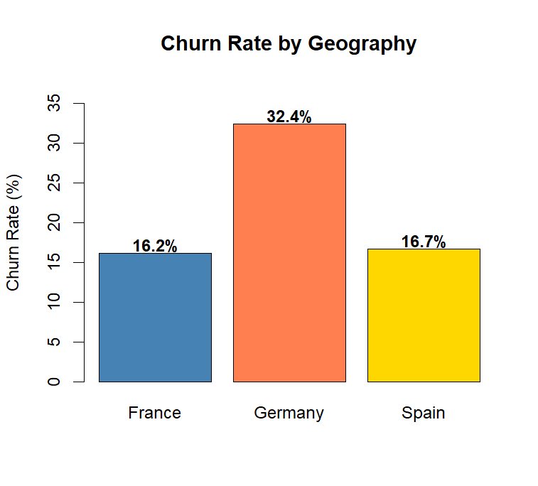
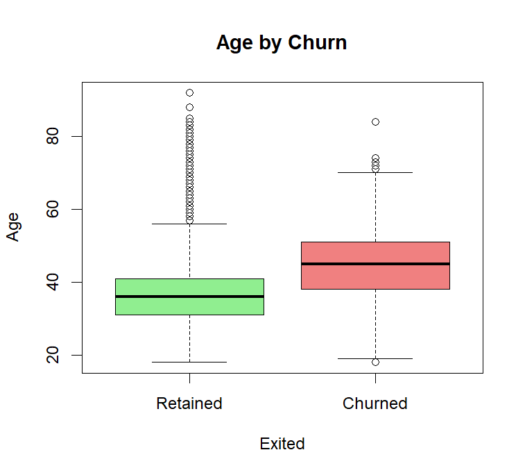
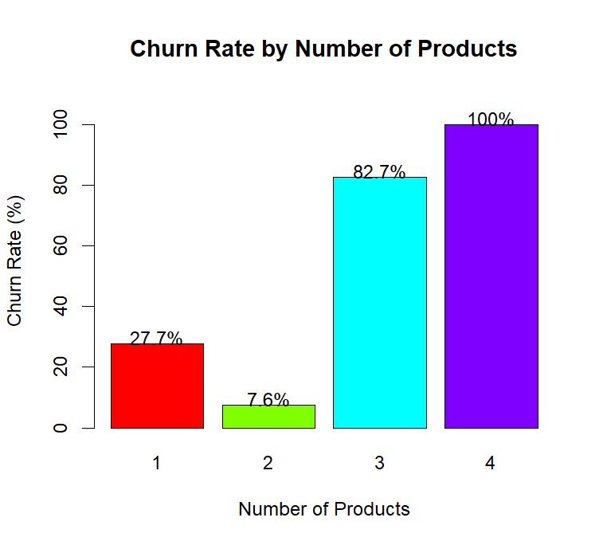
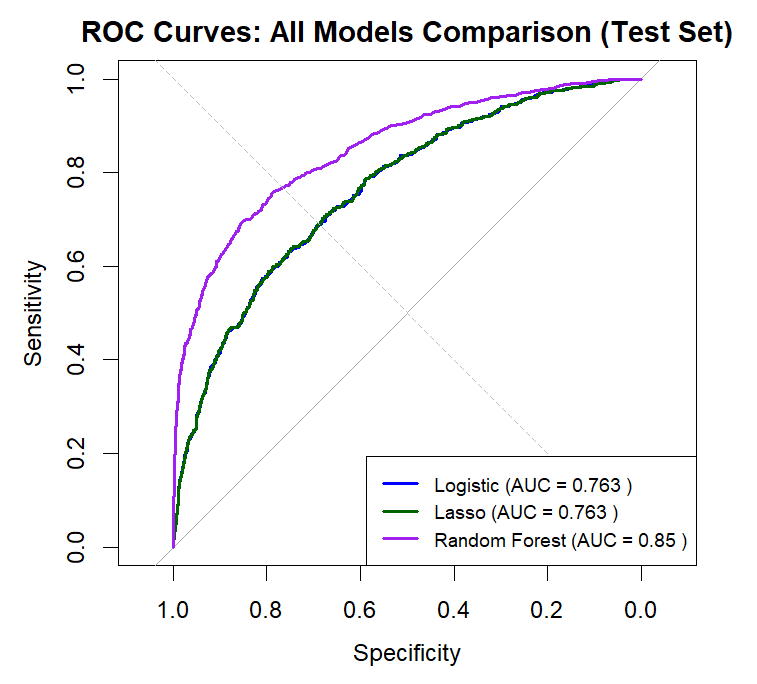
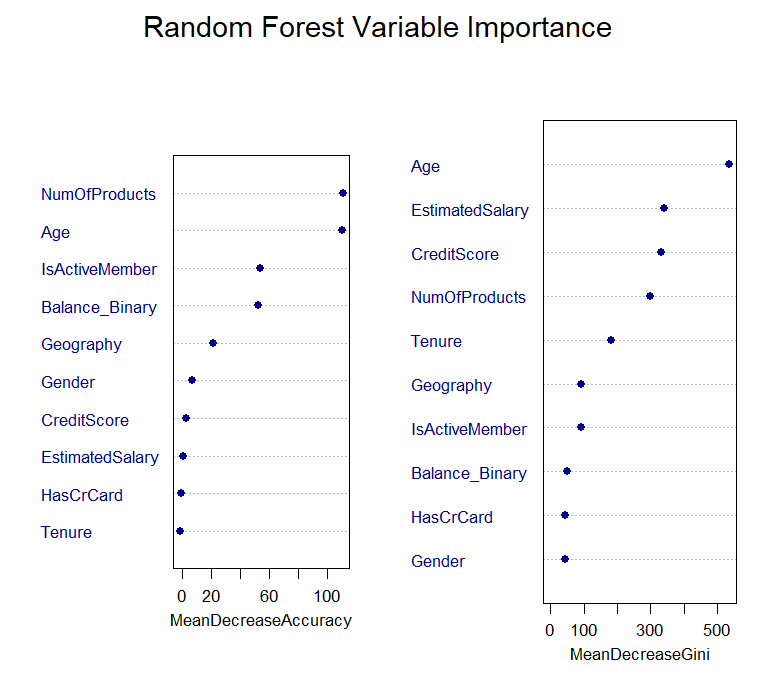

# Bank Customer Churn Analysis
**Predicting which customers are likely to leave — and what banks can do about it**


## Project Overview

Customer churn is expensive. When bank customers close their accounts and move to competitors, the bank loses far more than that month's fees-it loses years of future revenue and the entire relationship value. Research suggests acquiring new customers costs five to six times more than keeping existing ones, making retention a strategic priority.

This project analyzes churn patterns across 10,000 retail bank customers to answer two core questions:
- Which customer characteristics most strongly predict churn?
- Can we build a model that scores individual customer risk accurately enough to drive real retention decisions?


## Key Findings

**Germany is a red flag.** German customers churn at 32.4% versus 16.2% in France and 16.7% in Spain — nearly double the rate. Even after controlling for age, balance, and engagement, German customers show 124% higher churn odds. This signals a market-level problem that needs a market-level diagnosis.

**Age is the strongest predictor.** The 51–60 age group churns at 56.2% — more than 7x the rate of 18–30 year olds (7.5%). Each standard deviation increase in age more than doubles churn odds (OR = 2.05). Older customers are not being served in ways that keep them.

**Inactivity is a warning signal — and it's fixable.** Inactive customers churn at 26.9% versus 14.3% for active ones. Unlike age or geography, engagement is something banks can actually influence through product design and targeted campaigns.

**The balance paradox.** Customers with positive balances churn at nearly double the rate of zero-balance customers (24.1% vs 13.8%). This seems counterintuitive - but multivariate analysis reveals it's largely explained by age and activity status acting as confounders.

**Number of products is non-linear.** Two-product customers show the lowest churn (7.6%), but customers with three or four products churn at 82.7% and 100% respectively. More is not always better — aggressive cross-selling without product fit destroys retention.

---

## Visualizations

**Churn Distribution**


**Churn Rate by Geography**



**Age Distribution by Churn Status**



**Churn Rate by Number of Products**



**ROC Curves — All Models Compared**



**Random Forest Variable Importance**



---

## Methods

Three analytical approaches were used, each chosen for a specific reason:

**Hypothesis Testing (T-tests, Chi-square, ANOVA)** - To establish which variables show statistically significant differences between churned and retained customers before building any model. Cramér's V effect sizes were calculated alongside p-values to distinguish statistical significance from practical significance.

**Logistic Regression (with interaction term)** — To quantify each variable's independent contribution to churn while controlling for others. Produces odds ratios that are interpretable for business stakeholders, and probability scores that enable customer-level risk ranking.

**LASSO Regression** - To validate logistic regression findings through regularization and automatic variable selection. Cross-validated lambda selection via 10-fold CV.

**Random Forest** - To capture non-linear relationships and validate findings from regression models. Variable importance rankings (MeanDecreaseGini and MeanDecreaseAccuracy) provided an independent view of predictor relevance.


## Model Performance

| Metric | Logistic Regression | LASSO | Random Forest |
|---|---|---|---|
| Testing Accuracy | 80.9% | ~80.9% | 86.1% |
| Testing AUC | 0.784 | ~0.784 | ~0.86 |
| Sensitivity | 0.32 | ~0.32 | Higher |
| Specificity | High | High | High |

Random Forest delivered the strongest overall performance, though logistic regression remains the most interpretable for business decision-making.


## Business Recommendations

**1. Engagement-first retention programs.** Inactivity is the most actionable churn signal. Activation campaigns targeting declining-engagement customers -personalized feature prompts, bill payment setup, limited-time usage incentives — offer the highest return on retention investment.

**2. Germany market diagnostic.** A 124% elevated churn odds for German customers demands root-cause analysis before any intervention. Comparative benchmarking across pricing, product features, and service quality between Germany and other markets will clarify whether this is a pricing, product, or service problem.

**3. Age-adaptive retention strategies.** A one-size-fits-all retention approach fails older customers. Age-triggered touchpoints — proactive conversations when customers hit 40, 50, or 60 — can introduce relevant products before competitors do.

**4. Product fit over product count.** The goal should be moving single-product customers to two well-fitted products, not maximizing cross-sell volume. The 3–4 product churn data suggests aggressive selling without fit damages trust.

---

## Tools & Technologies

- **Language:** R
- **Libraries:** tidyverse, caret, glmnet, randomForest, pROC, corrplot, ggplot2, lsr, pscl
- **Methods:** Hypothesis testing, logistic regression, LASSO, random forest, ROC analysis

---

## Repository Structure

```
portfolio-bank-churn-analysis/
│
├── README.md                  
├── bank_churn_analysis.R      
├── churn.csv                  
├── Churn Distribution.png
├── Churn_by_geography.png
├── age_by_churn.png
├── Churn_by_product.png
├── ROC_Comparison_curve.png
└── Variable_importance_rf.png
```

---

## What I Would Do Next

- Address class imbalance using SMOTE or class weighting to improve sensitivity
- Explore interaction effects between age and geography
- Add temporal analysis if transaction-level data were available
- Deploy the logistic model as a live risk scoring tool using a Shiny dashboard

---

*Samidha Basrur | MPS Analytics, Northeastern University Toronto*
